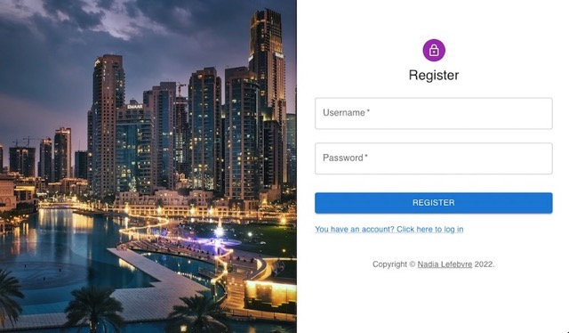

# Project Random Auth

Weekly project for Technigo's bootcamp, week 20: build a fullstack website including API and authentication frontend (May 2022)

## Tech stack

- JavaScript
- React
- Redux
- Node.js
- Express
- MongoDB
- HTML
- CSS
- Material UI
- API

## The problem

This week's project was to build an API with authentication to implement a registration flow, and a frontend with register/login form and a page with some content visible only for an authenticated user.

Project was quite simple. I used crypto and bcrypt for encryption of passwords. I used MateriaUI for styling, and I will try to become more comfortable in another project with this component library because it seems very interesting. I had some issues with the format of my response, but with a little help and some googling, I solved them.

## View it live

Random Auth App: [backend](https://random-auth-kijk33idxa-lz.a.run.app/) / [frontend](https://random-auth.netlify.app/)

  

